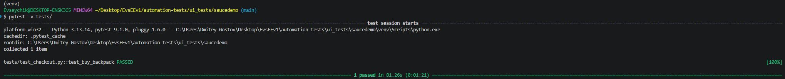
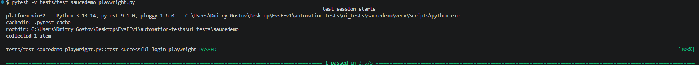
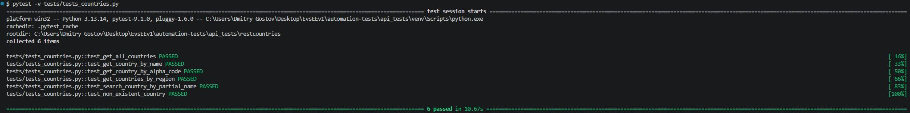

# Привет! Я Евсей Евсеев 👋
# 🚀 QA/AQA портфолио — Евсей

Ищу позицию Junior QA / Automation QA Engineer.

## 🧪 Автоматизация тестирования (Python)

**Как запустить:**

*Требуется Python 3.9+ и Git.*

```bash
# 1. Склонировать репозиторий
git clone https://github.com/EvsEEv1/EvsEEv1.git
cd EvsEEv1
```
```bash
# 2. UI-тесты (SauceDemo)
cd automation-tests/ui_tests/saucedemo
python3 -m venv venv
source venv/bin/activate      # macOS/Linux
# venv\Scripts\activate       # Windows
pip install -r requirements.txt
pytest -v tests/
```
```bash
# 3. API-тесты (Rest Countries)
cd ../../api_tests/restcountries
python3 -m venv venv
source venv/bin/activate      # macOS/Linux
# venv\Scripts\activate       # Windows
pip install -r requirements.txt
pytest -v tests/
```
### UI-тесты (SauceDemo)
- E2E сценарий покупки товара: логин → каталог → корзина → оформление
- **Стек:** Python 3.13+, Selenium, Pytest, WebDriver Manager
- **Паттерны:** Page Object Model, фикстуры, явные/неявные ожидания
- **Код:** [посмотреть проект](https://github.com/EvsEEv1/EvsEEv1/tree/main/automation-tests/ui_tests/saucedemo)



- **Playwright:** альтернативный тест логина → [код](https://github.com/EvsEEv1/EvsEEv1/tree/main/automation-tests/ui_tests/saucedemo/tests/test_saucedemo_playwright.py)
  


### API-тесты (Rest Countries v5)
- Тестирование публичного REST API с авторизацией по ключу
- **Стек:** Python 3.13+, Requests, Pytest
- **Особенности:** адаптация под новую версию API, проверка метаданных, поисковые запросы, негативные сценарии

- **Код:** [посмотреть проект](https://github.com/EvsEEv1/EvsEEv1/tree/main/automation-tests/api_tests/restcountries)




## 🛠 Ручное тестирование
- **Тестовое задание Triangle 2000** (50+ тест-кейсов, 8 баг-репортов) → [посмотреть](https://github.com/EvsEEv1/EvsEEv1/tree/main/test-assignment-triangle2000)
- **Postman-коллекция Petstore** (CRUD, автотесты) → [скачать](https://github.com/EvsEEv1/EvsEEv1/blob/main/postman-collections/PetStore.postman_collection.json)

## 📊 SQL
- **Примеры запросов** (SELECT, JOIN, GROUP BY) → [файл](https://github.com/EvsEEv1/EvsEEv1/blob/main/examples/sql-examples.sql)

## 📫 Контакты
- Telegram: @Evseev_Evsey
- Email: powerfulpugilist@gmail.com
- Резюме: [ссылка на hh.ru](https://novosibirsk.hh.ru/resume/79fdc0a5ff104c24a50039ed1f435648336364)