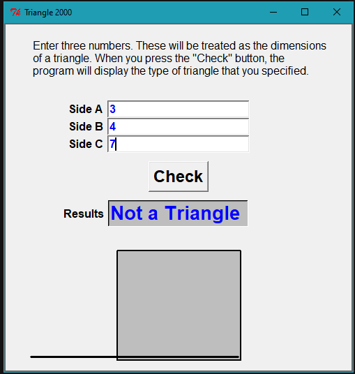
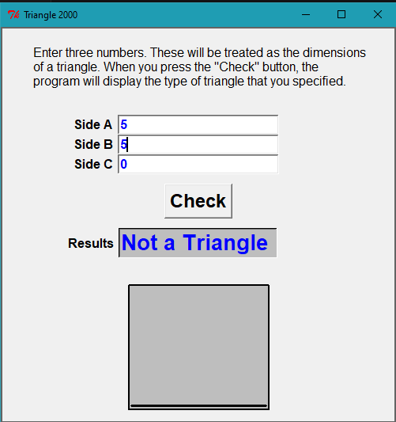
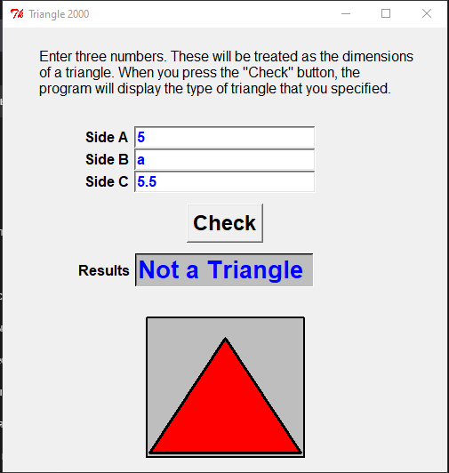
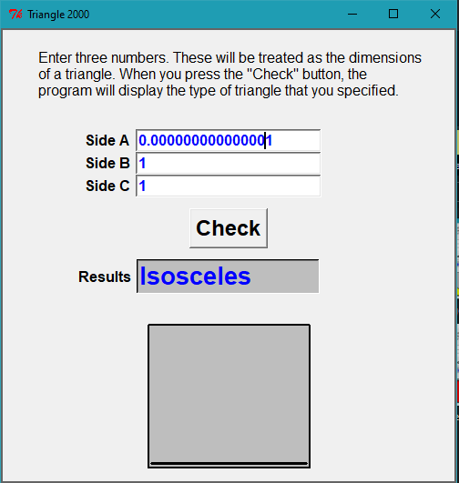
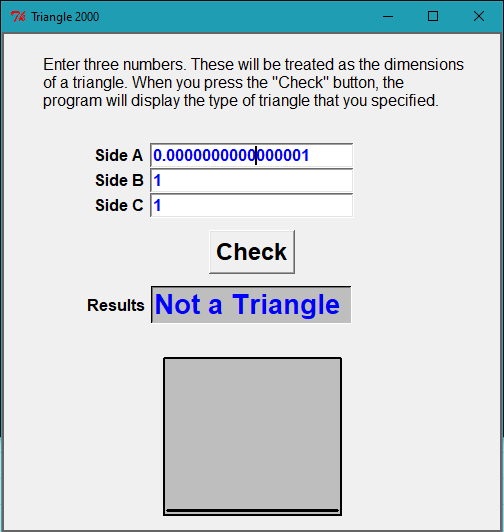
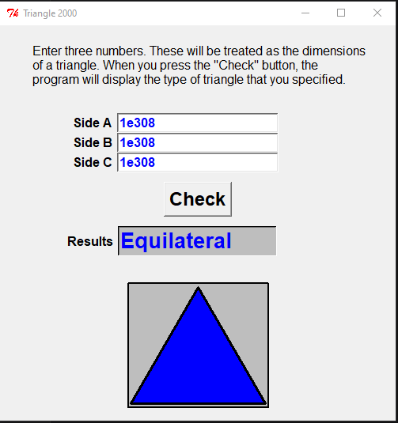
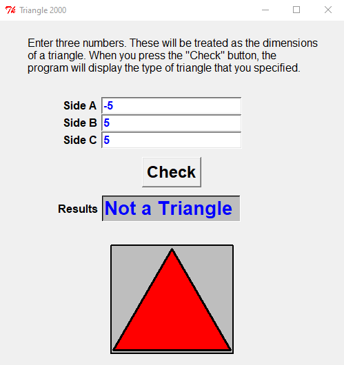
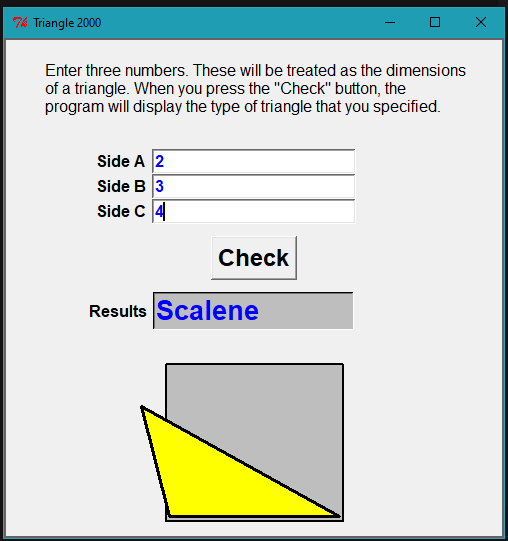
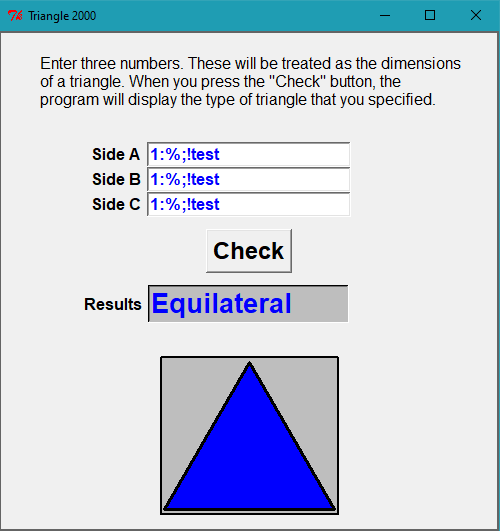

# Тестирование программы Triangle 2000

| **Проект** | Triangle 2000 |
|------------|------------------|
| **Окружение** | Windows 10|
| **Дата тестирования** | 18.02.2026 |
| **Тестировщик** | Евсеев Евсей |

## Smoke-тest checklist:
- [ ] Запуск программы
- [ ] Интерфейс читаемый (поля, кнопки, надписи видны)
- [ ] Равносторонний треугольник: 5,5,5 → "Equilateral" + треугольник нарисован
- [ ] Равнобедренный треугольник: 5,5,3 → "Isosceles" + треугольник нарисован
- [ ] Разносторонний треугольник: 3,4,5 → "Scalene" + треугольник нарисован
- [ ] Проверка отрисовки (рисуется ли треугольник?)
- [ ] Некорректные данные: "a",5,5 → программа не падает, выдаёт "Not a triangle" или ошибку
- [ ] Кнопка Check работает при каждом нажатии
- [ ] Проверка кнопки выхода (крестик)
- [ ] Программа полностью выгружается из памяти (проверить в диспетчере задач)

---
# Тест-кейсы для программы Triangle

## Позитивные тесты (валидные треугольники)

| ID | Название | A | B | C | Ожидаемый результат | Фактический результат | Примечание |
|-----|----------|---|---|---|---------------------|----------------------|------------|
| TC-001 | Равносторонний треугольник | `10` | `10` | `10` | Equilateral | `Equilateral` | Все стороны равны |
| TC-002 | Равнобедренный треугольник (A=B) | `10` | `10` | `5` | Isosceles | `Isosceles` | Две стороны равны |
| TC-003 | Разносторонний треугольник (прямоугольный) | `3` | `4` | `5` | Scalene | `Scalene` (на картинке прямоугольный треугольник) | 3-4-5 |
| TC-004 | Разносторонний треугольник (остроугольный) | `5` | `6` | `7` | Scalene | `Scalene` (на картинке остроугольный треугольник) | 5-6-7 |
| TC-005 | Разносторонний треугольник (тупоугольный) | `2` | `3` | `4` | Scalene | `Scalene` (на картинке тупоугольный треугольник вышел за края области прорисовки. Именно в этом порядке. В других случаях треугольник отображается корректно)  | 2-3-4 |

## Негативные тесты (не треугольники)

| ID | Название | A | B | C | Ожидаемый результат | Фактический результат | Примечание |
|-----|----------|---|---|---|---------------------|----------------------|------------|
| TC-006 | Сумма двух равна третьей | `3` | `4` | `7` | Not a triangle | `Not a triangle` (появилась полоса в области прорисовки)  | 3 + 4 = 7 |
| TC-007 | Сумма двух меньше третьей | `2` | `3` | `6` | Not a triangle | `Not a triangle` | 2 + 3 < 6 |
| TC-008 | Одна сторона слишком большая | `1` | `1` | `1000` | Not a triangle | `Not a triangle` | 1 + 1 < 1000 |

## Граничные значения

| ID | Название | A | B | C | Ожидаемый результат | Фактический результат | Примечание |
|-----|----------|---|---|---|---------------------|----------------------|------------|
| TC-009 | Минимальные положительные числа (равные) | `0.000001` | `0.000001` | `0.000001` | Equilateral | `Equilateral` | Дробные поддерживаются |
| TC-010 | Минимальные положительные числа (одно малое) | `0.000000000000001` | `1` | `1` | Isosceles | `Isosceles` | Дробные поддерживаются |
| TC-011 | Минимальные положительные числа (одно очень малое) | `0.0000000000000001` | `1` | `1` | Isosceles | `Not a triangle` | Потеря точности? |
| TC-012 | Минимальные положительные числа (все очень малые) | `0.0000000000000001` | `0.0000000000000001` | `0.0000000000000001` | Equilateral | `Equilateral` | Лимит не достигнут |
| TC-013 | Максимально большие числа | `9` x 138 раз | `9` x 138 раз | `9` x 138 раз | Equilateral | `Equilateral` | Проверка переполнения |
| TC-014 | Экспоненциальная форма (в пределах double) | `1e308` | `1e308` | `1e308` | Equilateral или ошибка | `Equilateral` + `SIDEA.ERROR: ILLEGAL CHARACTER`** | Противоречивое состояние |
| TC-015 | Экспоненциальная форма (слишком большая степень) | `1e10000` | `1e10000` | `1e10000` | Not a triangle или ошибка | `Not a triangle` | |
| TC-016 | Число + символ + текст | `1:%;!test` | `1:%;!test` | `1:%;!test` | Not a triangle или ошибка | `Equilateral` + **ILLEGAL CHARACTER** | Противоречивое состояние (парсер умер)|

**Лог TC-014:**
SIDEA: 1e308
SIDEB: 1e308
SIDEC: 1e308
TYPE: E
SIDEA.ERROR: ILLEGAL CHARACTER
SIDEB.ERROR: ILLEGAL CHARACTER
SIDEC.ERROR: ILLEGAL CHARACTER

**Лог TC-014:**
SIDEA:	1:%;!test
SIDEB:	1:%;!test
SIDEC:	1:%;!test
TYPE:	E
SIDEA.ERROR:	ILLEGAL CHARACTER
SIDEB.ERROR:	ILLEGAL CHARACTER
SIDEC.ERROR:	ILLEGAL CHARACTER

## Нулевые значения

| ID | Название | A | B | C | Ожидаемый результат | Фактический результат | Примечание |
|-----|----------|---|---|---|---------------------|----------------------|------------|
| TC-017 | Одна сторона равна 0 | `0` | `5` | `5` | Not a triangle | `Not a triangle` (появилась полоса)  | Проверить для A, B, C |
| TC-018 | Две стороны равны 0 | `0` | `0` | `5` | Not a triangle | `Not a triangle` (без полосы) | Проверить все комбинации |
| TC-019 | Все стороны равны 0 | `0` | `0` | `0` | Not a triangle | `Not a triangle` | |

## Пустые поля

| ID | Название | A | B | C | Ожидаемый результат | Фактический результат | Примечание |
|-----|----------|---|---|---|---------------------|----------------------|------------|
| TC-020 | Одно пустое поле | `""` | `5` | `5` | Not a triangle |`Not a triangle` (полоса) | Проверить для A, B, C |
| TC-021 | Два пустых поля | `""` | `""` | `5` | Not a triangle | `Not a triangle` | Проверить все комбинации |
| TC-022 | Три пустых поля | `""` | `""` | `""` | Not a triangle |`Not a triangle`  | |

## Пробельные символы

| ID | Название | A | B | C | Ожидаемый результат | Фактический результат | Примечание |
|-----|----------|---|---|---|---------------------|----------------------|------------|
| TC-023 | Один пробел | `" "` | `5` | `5` | Not a triangle | `Not a triangle` | Проверить для A, B, C |
| TC-024 | Несколько пробелов | `"  "` | `5` | `5` | Not a triangle | `Not a triangle` | Проверить для A, B, C |
| TC-025 | Только пробелы | `" "` | `" "` | `" "` | Not a triangle | `Not a triangle` | |
| TC-026 | Пробелы вокруг числа | `" 5 "` | `5` | `5` | Equilateral | `Equilateral` | Работает trim |

## Спецсимволы

| ID | Название | A | B | C | Ожидаемый результат | Фактический результат | Примечание |
|-----|----------|---|---|---|---------------------|----------------------|------------|
| TC-027 | Табуляция | `"\t"` | `5` | `5` | Not a triangle | `Not a triangle` | Проверить для A, B, C |
| TC-028 | Перевод строки | `"\n"` | `5` | `5` | Not a triangle | `Not a triangle` | Проверить для A, B, C |
| TC-029 | Спецсимволы | `"!@#$%"` | `5` | `5` | Not a triangle | `Not a triangle` | Проверить для A, B, C |
| TC-030 | HTML-теги (строчные) | `"<script>"` | `5` | `5` | Not a triangle | `Not a triangle` | Проверить для A, B, C |
| TC-031 | HTML-теги (заглавные) | `"<SCRIPT>"` | `5` | `5` | Not a triangle | `Not a triangle` | Проверить для A, B, C |
| TC-032 | Кавычки | `"''"` | `5` | `5` | Not a triangle | `Not a triangle` | Проверить для A, B, C |
| TC-033 | Путь к файлу | `"C:\\Windows"` | `6` | `7` | Not a triangle | `Not a triangle` | Проверить для A, B, C |

## Отрицательные числа

| ID | Название | A | B | C | Ожидаемый результат | Фактический результат | Примечание |
|-----|----------|---|---|---|---------------------|----------------------|------------|
| TC-034 | Одно отрицательное | `-5` | `5` | `5` | Not a triangle | `Not a triangle` + красный равносторонний треугольник  | Проверить для A, B, C |
| TC-035 | Два отрицательных | `-5` | `-5` | `5` | Not a triangle | `Not a triangle` + красный равносторонний треугольник | Проверить все комбинации |
| TC-036 | Три отрицательных | `-5` | `-5` | `-5` | Not a triangle | `Not a triangle` + красный равносторонний треугольник | |

## Дробные числа

| ID | Название | A | B | C | Ожидаемый результат | Фактический результат | Примечание |
|-----|----------|---|---|---|---------------------|----------------------|------------|
| TC-037 | Одно дробное | `5.5` | `5` | `5` | Isosceles | `Isosceles` (отрисовка корректна) | Дробные поддерживаются |
| TC-038 | Два дробных | `5.5` | `5.5` | `5` | Isosceles | `Isosceles` (отрисовка корректна) | Дробные поддерживаются |
| TC-039 | Все дробные | `5.5` | `5.5` | `5.5` | Equilateral | `Equilateral` (отрисовка корректна) | Дробные поддерживаются |

## Буквы и текст

| ID | Название | A | B | C | Ожидаемый результат | Фактический результат | Примечание |
|-----|----------|---|---|---|---------------------|----------------------|------------|
| TC-040 | Одна буква | `"a"` | `5` | `5` | Not a triangle | `Not a triangle` | Проверить для A, B, C |
| TC-041 | Две буквы | `"a"` | `"b"` | `5` | Not a triangle | `Not a triangle` | Проверить все комбинации |
| TC-042 | Три буквы | `"a"` | `"b"` | `"c"` | Not a triangle | `Not a triangle` | |

## Комбинаторные тесты

| ID | Название | A | B | C | Ожидаемый результат | Фактический результат | Примечание |
|-----|----------|---|---|---|---------------------|----------------------|------------|
| TC-043 | Пробел + буква | `" a"` | `5` | `5` | Not a triangle | `Not a triangle` | |
| TC-044 | Ноль + пробел | `"0"` | `" "` | `5` | Not a triangle | `Not a triangle` | |
| TC-045 | Отрицательное + буква | `"-5"` | `"a"` | `5` | Not a triangle | `Not a triangle` | |
| TC-046 | Пустое + большое | `""` | `999999` | `999999` | Not a triangle | `Not a triangle` | |
| TC-047 | Буква, целое и дробное | `5` | `"a"` | `"5.5"` | Not a triangle | `Not a triangle` + красный равносторонний треугольник (только в этой комбинации) | Проверить все комбинации |

## UI и отрисовка

| ID | Название | Действие | Ожидаемый результат | Фактический результат | Примечание |
|-----|----------|----------|---------------------|----------------------|------------|
| TC-048 | Проверка отрисовки (3,4,5) | Ввести `3`,`4`,`5`, Check | Треугольник в рамке | Треугольник в рамке | |
| TC-049 | Отрисовка с пустым полем (C) | Ввести `3`,`4`,``, Check | Not a triangle (без полосы) | `Not a triangle` (появилась полоса) | Баг отрисовки |
| TC-050 | Отрисовка с пустыми полями (B,C) | Ввести `3`,``,``, Check | Not a triangle (без полосы) | `Not a triangle` (без полосы) | |
| TC-051 | Отрисовка при Not a triangle | Ввести `1`,`1`,`1000`, Check | Not a triangle (без полосы) | `Not a triangle` (без полосы) | |
| TC-052 | Отрисовка равнобедренного | Ввести `10`,`10`,`5`, Check | Равнобедренный треугольник | Равнобедренный треугольник | Визуально корректно |
| TC-053 | Масштабирование | Ввести `1000`,`1000`,`1000`, Check | Треугольник помещается в рамку | Треугольник помещается в рамку | |

## Кнопки и взаимодействие

| ID | Название | Действие | Ожидаемый результат | Фактический результат | Примечание |
|-----|----------|----------|---------------------|----------------------|------------|
| TC-054 | Повторный ввод | Ввести `10`,`10`,`10` (Check), затем `5`,`5`,`5` (Check) | Результат обновляется | `Equilateral` → `Equilateral` | |
| TC-055 | Check без изменений | Нажать Check дважды подряд | Стабильность | Стабильно, логи пустые | |
| TC-056 | Ввод после ошибки | Ввести `"a"`,`5`,`5` (ошибка), затем `10`,`10`,`10` | Equilateral | `Equilateral` | Восстановление работает |
| TC-057 | Долгое нажатие | Зажать Enter / клик | Нет множественных окон | Нет множественных окон (лог пуст) | |
| TC-058 | Навигация Tab | Tab между полями | Фокус работает | Фокус работает | |
| TC-059 | Копипаст | Вставить `"10"` в поле | Работает | **Ctrl+C / Ctrl+V не работают**. Работает: **Ctrl+Insert** (копировать), **Shift+Insert** (вставить) | Баг или особенность старого GUI |

## Баг-репорты

### Баг-репорт #001: Скачет результат при сверхмалых числах

| Поле | Значение |
|------|----------|
| **Заголовок** | Isosceles и Not a triangle меняются от количества нулей |
| **Проект** | Triangle 2000 |
| **Компонент** | Расчет |
| **Приоритет** | Средний |
| **Серьезность** | Значительная |
| **Статус** | Открыт |
| **Автор** | Евсеев Евсей |

**Описание**  
Если в A ввести 0.000000000000001, а в B и C единицы — Isosceles. Если ввести 0.0000000000000001 — Not a triangle. Хотя треугольник должен быть в обоих случаях.

**Шаги**
1. A = 0.000000000000001, B = 1, C = 1 → Isosceles
2. A = 0.0000000000000001, B = 1, C = 1 → Not a triangle

**Ожидаемо**  
Либо всегда Isosceles, либо сообщение о минимальном числе.

**Скриншоты**

---

### Баг-репорт #002: Научная нотация ломает программу

| Поле | Значение |
|------|----------|
| **Заголовок** | 1e308 показывает Equilateral и ошибку одновременно |
| **Проект** | Triangle 2000 |
| **Компонент** | Парсер |
| **Приоритет** | Высокий |
| **Серьезность** | Критическая |
| **Статус** | Открыт |
| **Автор** | Евсеев Евсей |

**Описание**  
Вводишь 1e308 — на экране Equilateral, а в логах ILLEGAL CHARACTER. Не может быть одновременно и так и так.

**Шаги**
1. A = 1e308, B = 1e308, C = 1e308
2. Нажать Check

**Логи**
SIDEA: 1e308
SIDEB: 1e308
SIDEC: 1e308
TYPE: E
SIDEA.ERROR: ILLEGAL CHARACTER
SIDEB.ERROR: ILLEGAL CHARACTER
SIDEC.ERROR: ILLEGAL CHARACTER

**Скриншоты**

---

### Баг-репорт #003: Полоса при Not a triangle

| Поле | Значение |
|------|----------|
| **Заголовок** | В окне рисуется полоса, хотя треугольник не должен рисоваться |
| **Проект** | Triangle 2000 |
| **Компонент** | Отрисовка |
| **Приоритет** | Низкий |
| **Серьезность** | Незначительная |
| **Статус** | Открыт |
| **Автор** | Евсеев Евсей |

**Описание**  
При 3,4,7 или 5,5,0 программа пишет Not a triangle, но в окне есть полоса.

**Шаги**
1. A = 3, B = 4, C = 7
2. Нажать Check

**Ожидаемо**  
Пустое окно.

**Скриншоты**

---

### Баг-репорт #004: Красный треугольник на отрицательные числа

| Поле | Значение |
|------|----------|
| **Заголовок** | При отрицательных числах рисуется красный треугольник |
| **Проект** | Triangle 2000 |
| **Компонент** | Отрисовка |
| **Приоритет** | Средний |
| **Серьезность** | Значительная |
| **Статус** | Открыт |
| **Автор** | Евсеев Евсей |

**Описание**  
Вводишь -5,5,5 — Not a triangle, но рисуется красный треугольник.

**Шаги**
1. A = -5, B = 5, C = 5
2. Нажать Check

**Ожидаемо**  
Без рисунка.

**Скриншоты**

---

### Баг-репорт #005: Треугольник вылезает за рамку

| Поле | Значение |
|------|----------|
| **Заголовок** | Тупоугольный треугольник (2,3,4) не помещается |
| **Проект** | Triangle 2000 |
| **Компонент** | Отрисовка |
| **Приоритет** | Низкий |
| **Серьезность** | Незначительная |
| **Статус** | Открыт |
| **Автор** | Евсеев Евсей |

**Описание**  
2,3,4 — треугольник рисуется, но частично за рамкой. Если переставить стороны (3,2,4) — нормально.

**Шаги**
1. A = 2, B = 3, C = 4
2. Нажать Check

**Ожидаемо**  
Помещается всегда.

**Скриншоты**

 

---

### Баг-репорт #006: Не работают Ctrl+C / Ctrl+V

| Поле | Значение |
|------|----------|
| **Заголовок** | Копипаст только через Ctrl+Insert / Shift+Insert |
| **Проект** | Triangle 2000 |
| **Компонент** | UI |
| **Приоритет** | Низкий |
| **Серьезность** | Незначительная |
| **Статус** | Открыт |
| **Автор** | Евсеев Евсей |

**Описание**  
Ctrl+C и Ctrl+V не работают. Копировать — Ctrl+Insert, вставить — Shift+Insert.

**Шаги**
1. Выделить текст
2. Нажать Ctrl+C

**Ожидаемо**  
Копируется.

---

### Баг-репорт #007: Мусор работает как число

| Поле | Значение |
|------|----------|
| **Заголовок** | "1:%;!test" воспринимается как 1 и дает Equilateral |
| **Проект** | Triangle 2000 |
| **Компонент** | Парсер |
| **Приоритет** | Высокий |
| **Серьезность** | Критическая |
| **Статус** | Открыт |
| **Автор** | Евсеев Евсей |

**Описание**  
Строка с мусором (1:%;!test) воспринимается как число 1, и программа выдает Equilateral.

**Шаги**
1. A = 1:%;!test, B = 1:%;!test, C = 1:%;!test
2. Нажать Check

**Логи**
SIDEA: 1:%;!test
SIDEB: 1:%;!test
SIDEC: 1:%;!test
TYPE: E
SIDEA.ERROR: ILLEGAL CHARACTER
SIDEB.ERROR: ILLEGAL CHARACTER
SIDEC.ERROR: ILLEGAL CHARACTER

**Скриншоты**

---

### Баг-репорт #008: Красный треугольник в комбинации 5, a, 5.5

| Поле | Значение |
|------|----------|
| **Заголовок** | 5, a, 5.5 рисует красный треугольник |
| **Проект** | Triangle 2000 |
| **Компонент** | Отрисовка |
| **Приоритет** | Средний |
| **Серьезность** | Значительная |
| **Статус** | Открыт |
| **Автор** | Евсеев Евсей |

**Описание**  
Только в этой комбинации (5, a, 5.5) при Not a triangle появляется красный треугольник. В других комбинациях с буквами — нет.

**Шаги**
1. A = 5, B = a, C = 5.5
2. Нажать Check

**Ожидаемо**  
Без рисунка.

**Скриншоты**

---
# Заключение 

## Что тестировал

- Обычные треугольники (3,4,5; 5,5,5; 10,10,5)
- Не треугольники (1,1,1000; 3,4,7)
- Очень маленькие числа (0.000001 и меньше)
- Очень большие числа (999999 и больше)
- Научную нотацию (1e308, 1e3)
- Буквы, пробелы, символы
- Отрицательные числа
- Отрисовку треугольников
- Кнопки и копипаст

---

## Что работает

- Простые треугольники определяются правильно
- Неравенство треугольника работает (Not a triangle когда надо)
- Программа не падает вообще, даже от мусора
- Дробные числа считает нормально

---

## Что работает неидеально

- Иногда при Not a triangle появляется полоса в окне
- Тупоугольный треугольник (2,3,4) вылезает за рамку
- При отрицательных числах рисуется красный треугольник
- Очень маленькие числа ведут себя странно (то Isosceles, то Not a triangle)
- Ctrl+C / Ctrl+V не работают (только Ctrl+Insert / Shift+Insert)

---

## Что сломано

- Научная нотация (1e308) — пишет Equilateral и одновременно ошибку в логах
- Мусор типа "1:%;!test" воспринимается как число 1 и тоже дает Equilateral

---

## Итог

Программа работает, но с багами. Для учебы пойдет, если вводить обычные числа. Для работы надо чинить.

---
